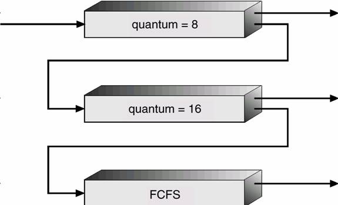

# Part A Scheduling:

Implementation of Take, Central Que, FIFO/Round-Robin [Scheduling Algorithms](https://en.wikipedia.org/wiki/Scheduling_(computing)#Scheduling_disciplines) - A Simulation Study.

### Reference:
	S. Curran and M Stumm, “A Comparison of basic CPU Scheduling Algorithms for Multiprocessor Unix”, Computer Systems, 3(4), Oct., 1990, pp. 551--579.

### Dependancies:

[Microsoft Visual Studio Express 2013](https://www.microsoft.com/en-pk/download/details.aspx?id=44914)

[.NET Framework 4.5](https://www.microsoft.com/en-pk/download/details.aspx?id=40779) will be required to execute.

### Run Application:

```sh
~Project_Dire\bin\Debug folder contain AOS-A1-P1.exe, input.txt and output.txt
```

## Group Members:

1. Nayyar Ahmed <MSCS14059@ITU.EDU.PK>
2. Tahir Ahmed  <MSCS14059@ITU.EDU.PK>
3. Kaleem Ullah <MSCS14059@ITU.EDU.PK>
4. Rai Rashid   <MSCS14059@ITU.EDU.PK>


##Introduction:

### Take Algorithm:

Each processor has its own separate ready queue, and tasks are initially assigned
to the queue of one of the processors. Each processor executes tasks from its own queue
whenever possible, but raids the queues of the other processors when its own queue is empty.

### Central Que Algorithm:

All processors of the multiprocessor share a single ready queue. (This
requires that accesses to the queue be synchronized.)

### Multilevel feedback FIFO/RR Algorithm:
  
Three queues:
    1. Q0 – time quantum 8 milliseconds
    2. Q1 – time quantum 16 milliseconds
    3. Q2 – FCFS

Scheduling
1. A new job enters queue Q0 which is served FCFS . When it gains CPU, job receives 8 milliseconds.
    If it does not finish in 8 milliseconds, job is moved to queue Q1.
2. At Q1 job is again served FCFS and receives 16 additional milliseconds. If it still does not complete,
     it is preempted and moved to queue Q2.





